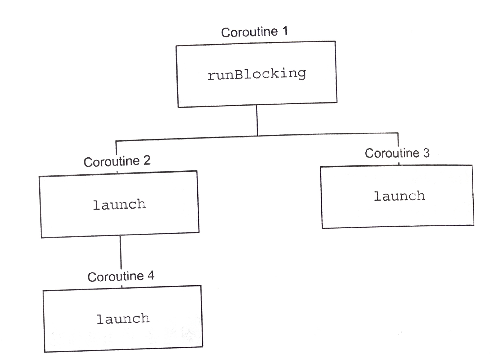
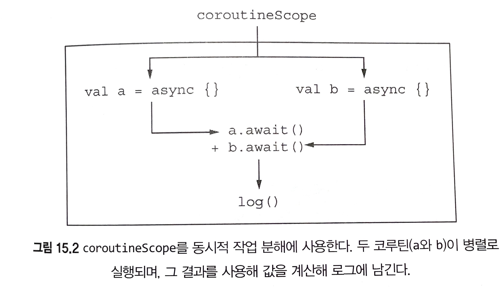
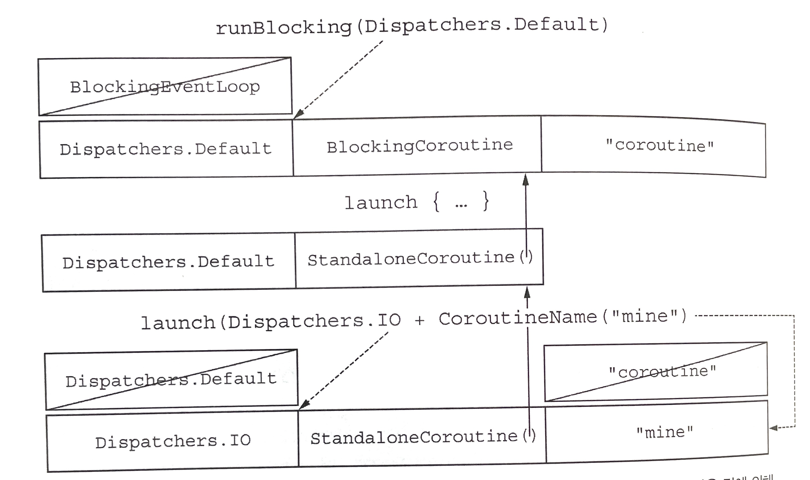

# 15장. 구조화된 동시성

구조화된 동시성

- 애플리케이션 안에서 코루틴과 그 생애주기의 계층을 관리하고 추적
- 수동으로 시작된 코루틴을 일일히 추적하지 않아도 기본적으로 작동함

# 15.1 코루틴 스코프: 코루틴 간의 구조를 확립

코루틴 스코프

- 코루틴간의 부모-자식 관계를 확립하는데 도움을 준다.
- CoroutineScope 인터페이스의 확장 함수인 launch, async 사용

```kotlin
fun main() {
		runBlocking {
				launch {
						delay(1.seconds)
						launch{
								delay(250.milliseconds)
								log("GrandChild done")
						}
						log("Child 1 done!")
				}
				launch {
						delay(500.milliseconds)
						log("Child 2 done!")
				}
				log("Parent done!")
		}
}
```

출력

```kotlin
Parent Done!
Child 2 Done!
child 1 Done!
GrandChild done
```

- 모든 자식 코루틴이 완료될 때까지 프로그램이 종료되지 않음 → 코루틴 간에는 부모-자식 관계가 있음
- runBlocking은 어떤 자식 코루틴이 작업 중인지 알고 모든 작업이 완료될 때까지 기다림
- 실행한 코루틴이나 그 자손을 수동으로 추적할 필요 없음



## 15.1.1 코루틴 스코프 생성: coroutineScope 함수

코루틴 빌더를 사용해서 생성한 코루틴 → 자체적인 CoroutineScope 생성

coroutineScope 함수

- 일시 중단 함수
- 새로운 코루틴 스코프를 생성하고 해당 영역 안의 모든 자식 코루틴이 완료될 때까지 대기
- 동시적 작업 분해에 사용 → 여러 코루틴을 활용해 계산 수행



## 15.1.2 코루틴 스코프를 컴포넌트와 연관시키기: CoroutineScope

CoroutineScope

- 코루틴의 구체적 생명주기를 정의, 동시 처리, 코루틴의 시작과 종료를 관리하는 클래스를 만들고 싶을 때 사용
- 독자적인 코루틴 스코프 생성
- 실행을 일시 중단하지 않음
- 새로운 코루틴 스코프 생성
- 스코프와 연관된 코루틴 콘텍스트를 파라미터로 받음 (해당 범위에서 시작된 코루틴이 사용할 디스패처 지정)
- CoroutineScope와 함께 SupervisorJob을 사용하는 것이 좋음
    - 동일한 영역과 관련된 다른 코루틴을 취소하지 않음
    - 처리되지 않은 예외를 전파하지 않게 해줌

```kotlin
private val scope = CoroutineScope(dispatcher + SupervisorJob())
```

- launch를 통해 작업 수행, cancel을 통해 작업 취소를 진행한다.

### coroutineScope vs. CoroutineScope

coroutineScope

- 작업을 동시성으로 실행하기 위해 분해할 때 사용
- 여러 코루틴을 시작하고, 완료될 때가지 기다리며, 결과를 계산할 수도 있음
- 일시 중단 함수

CoroutineScope

- 코루틴을 클래스의 생명주기와 연관시키는 영역을 생성할 때 사용
- 영역을 생성하지만 추가 작업을 기다리지 않고 즉시 반환
- 반환된 코루틴 스코프를 나중에 취소

## 15.1.3 GlobalScope의 위험성

GlobalScope

- 전역 수준에 존재하는 코루틴 스코프
- 전역 범위에서 시작된 코루틴은 자동으로 취소되지 않음
- 생명주기에 대한 개념도 없음
- 리소스 누수가 발생하거나 불필요한 작업을 계속 수행하면서 자원을 낭비함
- 구조화된 동시성에서 자동으로 설정되는 계층 구조가 깨져서 즉시 종료됨
- 일반적인 애플리케이션 코드에서 사용되는 것은 나쁜 생각!

→ GlobalScope를 사용하기 위해서는 이해를 잘 하고 있어야 한다!

## 15.1.4 코루틴 콘텍스트와 구조화된 동시성

코루틴 콘텍스트 → 코루틴간의 부모-자식 계층을 따라 상속됨

새로운 코루틴 시작 시 코루틴 콘텍스트에서 일어나는 일

- 자식 코루틴은 부모 코루틴을 상속받음
- 새로운 코루틴은 부모-자식 관계를 설정하는 역할을 하는 새 Job 객체를 생성
- 코루틴 콘텍스트에 전달된 인자가 적용

디스패처를 지정하지 않고 새로운 코루틴을 시작한다면? → 부모 코루틴의 디스패처에서 실행!



- 코루틴과 연관된 Job 관계
- coroutineScope함수도 Job 객체를 갖고 부모-자식 계층 구조에 참여함

# 15.2 취소

취소: 코드가 완료되기 전에 실행을 중단하는 것

- 불필요한 작업을 막아줌
- 메모리나 리소스 누수 방지에 도움
- 오류 처이레서 중요한 역할을 함

## 15.2.1 취소 촉발

launch → Job 반환

async → Deferred 반환

⇒ 둘다 cancel을 호출해 코루틴 취소를 촉발할 수 있음

## 15.2.2 시간제한이 초과된 후 자동으로 취소 호출

withTimeout

- 타임아웃이 되면 TimeoutCencellationException 발생
- CencellationException의 하위 타입이므로 반드시 잡아야 한다.
- 이 예외를 잡지 않으면 호출한 코루틴이 의도와 다르게 취소될 수 있다.

withTimeoutOrNull

- 타임아웃이 발생하면 null 반환

## 15.2.3 취소는 모든 자식 코루틴에게 전파

코루틴 취소 → 코루틴의 모든 자식 코루틴도 자동으로 취소

(각 코루틴은 자신이 시작한 다른 코루틴을 알고 있기 때문)

여러 코루틴이 중첩되어 있는 경우에도 가장 바깥 코루틴을 취소하면

→ 고손자 코루틴까지도 모두 취소

## 15.2.4 취소된 코루틴은 특별한 지점에서 CancellationException을 던진다

던지는 시점 → 일시 중단 지점 → 코루틴의 실행을 일시 중단할 수 있는 지점

코루틴 라이브러리 안의 모든 일시 중단 함수 → CancellationException이 던져질 수 있는 지점

이 예외를 사용해 코루틴 계층에서 취소를 전파하므로 예외를 실수로 처리하지 않도록 주의해야 함!

## 15.2.5 협력적인 취소

코루틴에 기본적으로 포함된 모든 함수 → 취소 가능

직접 작성한 코드 → 취소 가능하게 만들어야 함 → 취소 가능 지점 포함해야 함!

일시중단 함수는 스스로 취소 가능하게 로직을 제공해야 함

그럼 어떻게? → 취소 가능한 다른 함수를 호출할 때 → 취소 가능 지점이 생김

코루틴이 취소되었는지 확인하는 유틸리티

- ensureActive
- yield 함수
- isActive 속성

## 15.2.6 코루틴이 취소됐는지 확인

CoroutineScope의 isActive 속성

- 이 값이 false라면 더 이상 활성 상태가 아님
- 현재 작업을 완료하고 획득한 리소스를 닫은 후 반환할 수 있다.

ensureActive

- isActive가 false인 것을 알려주는 함수
- 코루틴이 더 이상 활성 상태가 아닐 경우 CancellationException을 던진다.

## 15.2.7 다른 코루틴에게 기회를 주기: yield 함수

- 코드 안에서 취소 가능 지점을 제공해줌
- 현재 점유된 디스패처에서 다른 코루틴이 작업할 수 있게 해 줌
- 코드에서 CancellationException을 던질 수 있는 지점 제공 & 대기 중인 다른 코루틴이 있으면 디스패처가 제어를 다른 코루틴에게 넘길 수 있게 해줌

## 15.2.8 리소스를 얻을 때 취소를 염두에 두기

코루틴 취소가 되면 → 리소스 반환 처리가 제대로 이뤄지지 않았을 수 있음

예외의 일종이니 finally나 Autoclosable을 통해 리소스 반환을 제때 하자.